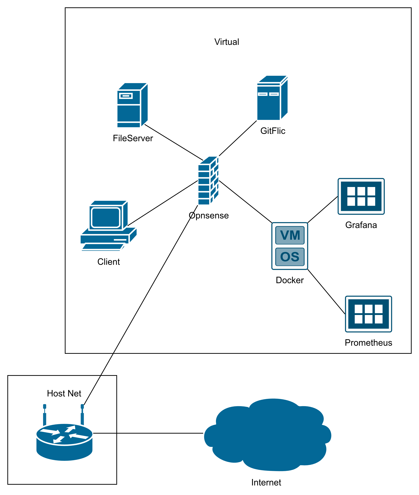
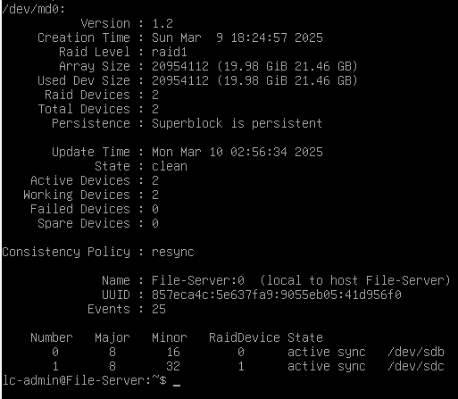
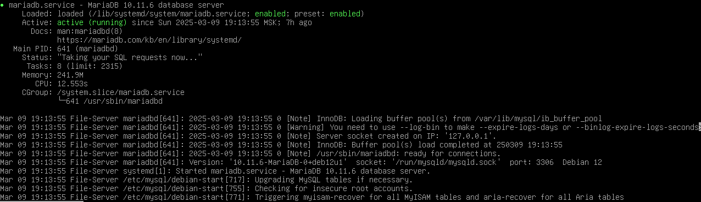
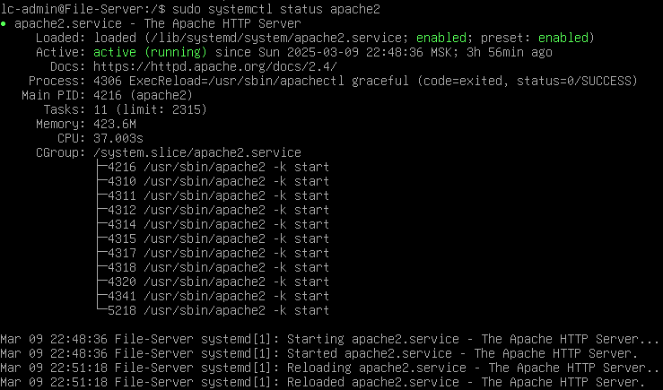
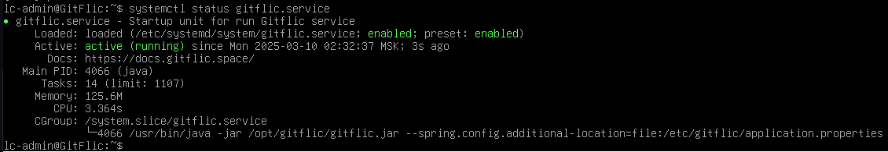
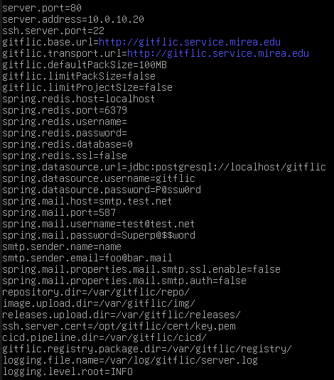
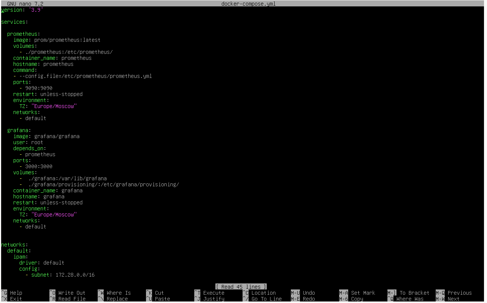

# RTUITLAB

Все машины имеют пользователя lc-admin с паролем P@ssw0rd, для сервиса gitflic
lc-admin@mail.mirea.edu/P@ssw0rd
IP-адресация:
OPNSense/10.0.5.1/10.0.10.1/FW.mirea.edu
File Server/10.0.10.15/FileServer.servers.mirea.edu
GitFlic/10.0.10.20/GitFlic.servers.mirea.edu
Docker/10.0.10.25/Docker.servers.mirea.edu

Также для сервисов:
Nextcloud.services.mirea.edu alias для File Server
GitFlic.services.mirea.edu alias для GitFlic

Что было сделано:
На Opnsense:
IP-адресация, DNS, DHCP, блокировка attendance.mirea.ru, Port Forwarding для Nextcloud

На File Server:
Создан software raid на mdadm:

Установлены MariaDB и Apache2, в Apache загружен Nextcloud

На GitFlic установлен GitFlic и его зависимости, создан systemd service

На Docker установлен docker, создан docker-compose конфиг для контейнеров Prometeus и Graphana

Ссылка на виртуалньвве машины: https://drive.google.com/file/d/1m-g2WDIyCOWEEUgywuyt5AA0mZOn2Zqf/view?usp=sharing.
